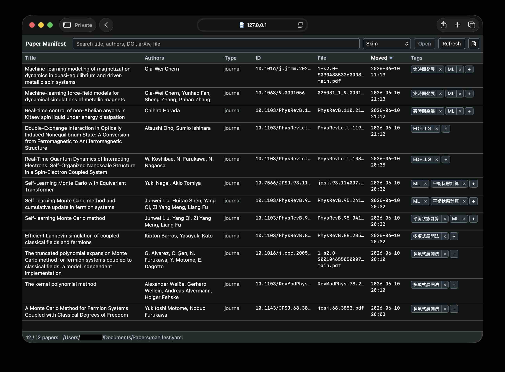

# pdf-triage

<p align="center">
  <strong>Local-first macOS PDF triage for research papers.</strong><br>
  Keep Downloads clean, build a YAML paper manifest, and browse it locally.
</p>

<p align="center">
  <a href="#features"><code>features</code></a>
  <a href="#library-layout"><code>library layout</code></a>
  <a href="#install-the-cli"><code>install</code></a>
  <a href="#manifest-viewer"><code>viewer</code></a>
  <a href="LICENSE"><code>MIT</code></a>
</p>

`pdf-triage` keeps `~/Downloads` clean by moving recognized research PDFs into a
paper library, extracting lightweight bibliographic metadata, and exposing a
compact local manifest viewer for search, sorting, tags, and opening PDFs in
Skim, Preview, the browser, or the system default app.

It is intentionally small:

- No cloud service or account.
- No LLM dependency.
- No database server.
- Plain files under `~/Documents/Papers`.
- A single YAML manifest you can inspect and edit.

## Features

- Watch `~/Downloads` with macOS Folder Actions.
- Move recognized arXiv and journal PDFs automatically.
- Leave unrecognized or non-paper PDFs untouched.
- Extract DOI/arXiv IDs, title, and authors using local metadata and
  `pdftotext` heuristics.
- Store all records in `~/Documents/Papers/manifest.yaml`.
- Browse the manifest in a compact local web viewer.
- Search, sort, tag papers, and open PDFs from the viewer.
- Run the viewer on demand, in the background, or as a login-time LaunchAgent.

<div align=center>
  
</div>

## Library Layout

Recognized PDFs are moved into:

- `~/Documents/Papers/arxiv`
- `~/Documents/Papers/journal`

The central manifest is:

```text
~/Documents/Papers/manifest.yaml
```

It stores file paths, source URL metadata when macOS provides it, DOI/arXiv
identifiers, extracted title/authors, triage category, and optional user tags.
Each triage run appends one JSON line to `logs/pdf_triage.log`.

## Requirements

- macOS with Folder Actions
- Python 3.10+ for the generated local CLI wrappers
- PyYAML in that Python environment
- Poppler tools (`pdftotext`, `pdfinfo`)

The checked-in scripts use a portable shebang:

```text
#!/usr/bin/env python3
```

Do not edit the checked-in shebang for each machine. Instead, install local
wrappers with the Python environment that should run `pdf-triage`.

For Poppler:

```bash
brew install poppler
```

The script looks in `/opt/homebrew/bin`, `/usr/local/bin`, and the inherited
`PATH`, because macOS Folder Actions may run with a narrower shell environment
than an interactive terminal.

For PyYAML:

```bash
conda install -n research PyYAML
```

## Install the CLI

From this repository, generate local wrappers under `~/.local/bin`:

```bash
PYTHON=/path/to/python ./scripts/install_cli.sh
```

For example, with a conda environment named `research`:

```bash
PYTHON=/opt/homebrew/anaconda3/envs/research/bin/python ./scripts/install_cli.sh
```

The generated files are small wrappers named `pdf_triage.py` and
`manifest_viewer.py`. They live outside the repository, pin the local Python
interpreter, and execute the repository scripts. This keeps machine-specific
environment paths out of version control while still working from macOS Folder
Actions and LaunchAgents, where `PATH` may be narrower than an interactive
terminal.

Check it:

```bash
ls -l ~/.local/bin/pdf_triage.py
~/.local/bin/pdf_triage.py --help
~/.local/bin/manifest_viewer.py --help
```

## Install the Folder Action

The source AppleScript lives at
`scripts/pdf_triage_folder_action.applescript`.

Compile it into the standard Folder Action Scripts directory. Do not copy the
text source as a `.scpt` file; the installed `.scpt` should be produced with
`osacompile`.

```bash
mkdir -p "$HOME/Library/Scripts/Folder Action Scripts"
osacompile \
  -o "$HOME/Library/Scripts/Folder Action Scripts/pdf_triage.scpt" \
  scripts/pdf_triage_folder_action.applescript
```

The compiled `.scpt` step is important. A plain-text file named `.scpt` may not
fire reliably as a Folder Action.

## Enable Downloads Auto-Trigger

Enable Folder Actions and attach `pdf_triage.scpt` to `~/Downloads`:

```bash
osascript \
  -e 'tell application "System Events"' \
  -e 'set folder actions enabled to true' \
  -e 'if not (exists folder action "Downloads") then make new folder action at end of folder actions with properties {path:POSIX file "'"$HOME"'/Downloads"}' \
  -e 'set enabled of folder action "Downloads" to true' \
  -e 'tell folder action "Downloads"' \
  -e 'if not (exists script "pdf_triage.scpt") then make new script at end of scripts with properties {name:"pdf_triage.scpt"}' \
  -e 'set enabled of script "pdf_triage.scpt" to true' \
  -e 'end tell' \
  -e 'end tell'
```

Verify:

```bash
osascript \
  -e 'tell application "System Events"' \
  -e 'set faEnabled to folder actions enabled' \
  -e 'set scriptNames to name of every script of folder action "Downloads"' \
  -e 'return "folder_actions_enabled=" & faEnabled & "; downloads_scripts=" & scriptNames' \
  -e 'end tell'
```

Expected:

```text
folder_actions_enabled=true; downloads_scripts=pdf_triage.scpt
```

## Debugging

Watch the execution log while downloading a PDF:

```bash
tail -f ./logs/pdf_triage.log
```

Test a file manually without moving it:

```bash
~/.local/bin/pdf_triage.py --dry-run ~/Downloads/example.pdf
```

Run the real move manually:

```bash
~/.local/bin/pdf_triage.py ~/Downloads/example.pdf
```

Folder Actions only trigger when a file is added. Files already in `~/Downloads`
must be processed manually.

To refresh metadata for a PDF that is already under `~/Documents/Papers`, run:

```bash
~/.local/bin/pdf_triage.py --no-wait ~/Documents/Papers/journal/example.pdf
```

Existing manifest data that is user-owned or historical, such as `tags`,
`file.original_path`, source metadata, and `triage.moved_at`, is preserved when
an entry is refreshed.

Metadata extraction is heuristic. It prefers usable PDF metadata, then falls
back to the first pages via `pdftotext`. Publisher headers such as APS/PRL
`week ending` and AIP article chrome are filtered, but unusual layouts may still
need manual correction in `manifest.yaml`.

## Manifest Viewer

Start the local viewer:

```bash
manifest_viewer.py
```

Then open:

```text
http://127.0.0.1:8765
```

Useful options:

```bash
manifest_viewer.py --viewer skim
manifest_viewer.py --viewer preview
manifest_viewer.py --viewer browser
manifest_viewer.py --papers-root ~/Documents/Papers --port 8765
```

Run it as a background process:

```bash
manifest_viewer.py --restart
manifest_viewer.py --status
manifest_viewer.py --stop
```

Install it as a macOS LaunchAgent so it starts when the user logs in:

```bash
manifest_viewer.py --install-launch-agent
manifest_viewer.py --status
```

Restart or remove the LaunchAgent:

```bash
manifest_viewer.py --restart
manifest_viewer.py --uninstall-launch-agent
```

The LaunchAgent file is:

```text
~/Library/LaunchAgents/com.pdf-triage.manifest-viewer.plist
```

The viewer preference is persisted at:

```text
~/Documents/Papers/.triage/viewer_config.json
```

The viewer UI lives in `web/manifest_viewer.html`; the Python script only serves
the page, manifest API, preferences API, tag API, PDF route, and PDF/manifest
open endpoints.

Keyboard:

- `/`: focus search
- `Up` / `Down`: select a row
- `Enter`: open the selected row

Search terms are OR-matched when separated by spaces. Tags are stored in each
manifest paper entry as `tags: [...]` and are included in search.

Tag behavior:

- `+`: add an existing or new tag.
- Tag name: append that tag to the search field.
- `x`: remove that tag from the manifest entry.

The tag input ignores Enter while an IME composition is active, so Japanese
conversion confirmation should not create a tag accidentally.

The toolbar's manifest button opens `manifest.yaml` with the system default app.

LaunchAgent logs are written to:

```text
logs/manifest_viewer.launchd.out.log
logs/manifest_viewer.launchd.err.log
```

## License

MIT License. See `LICENSE`.
